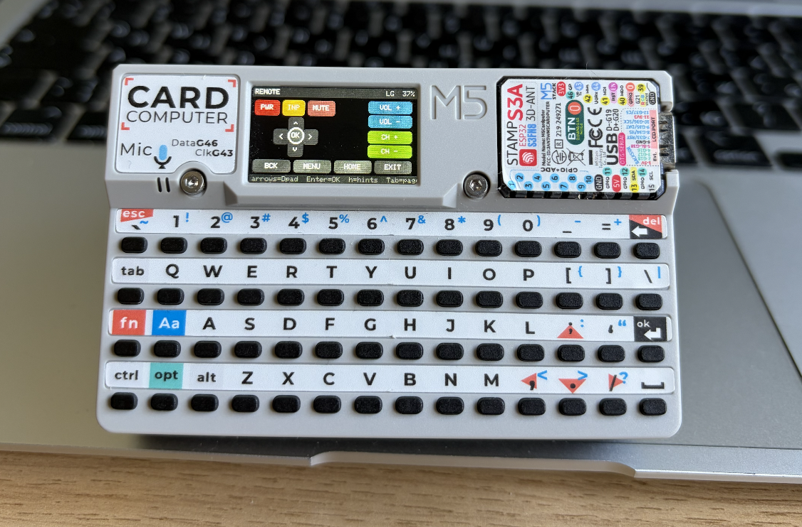
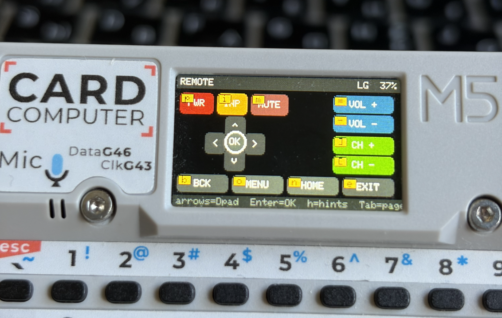

# Cardputer LG Remote

> A daily-driver LG TV remote running on the [M5Stack Cardputer](https://shop.m5stack.com/products/m5stack-cardputer-kit-w-m5stamps3).

Custom firmware that turns the Cardputer into a graphical TV remote: real
buttons on the 240x135 screen, IR over GPIO 44, pluggable per-brand code
profiles. The whole device acts like a remote — not a debug tool.

<p align="center">
  
</p>

---

## What it does

- Shows a real remote layout (power, input, mute, D-pad, OK, volume, channels,
  navigation, color keys, digits) on the 240x135 screen.
- Sends LG NEC32 IR codes through the built-in IR LED.
- Maps the physical Cardputer arrows + Enter directly to the TV's D-pad + OK,
  so you can use it one-handed without ever looking at the screen.
- Hold an arrow / volume / channel button to auto-repeat.
- Press `h` to toggle on-screen hint badges showing every key binding.
- Live battery percent in the header.
- Swap IR profiles at runtime if codes differ on your set.

<p align="center">
  
</p>

The badges in the corner of each button (`p`, `i`, `m`, `b`, `o`, `n`, `e`, ...)
are the physical keys that fire those commands instantly.

---

## Hardware

- **M5Stack Cardputer** (StampS3 + QWERTY + 1.14" TFT + IR LED on GPIO 44)
- USB-C cable to flash
- An LG TV within ~3-5 m line-of-sight

Range and reliability depend on your TV model and the Cardputer's IR LED drive
strength. Verify codes via the Settings screen ("LAST SENT" readout).

---

## Quick start

```sh
# 1. Install PlatformIO (macOS with Homebrew Python: use pipx)
pipx install platformio

# 2. Clone + flash
git clone https://github.com/<you>/cardputer-remote-lg-control.git
cd cardputer-remote-lg-control
make flash
```

If `make flash` fails to detect the device: hold **G0** (bottom-left key), tap
**reset**, release **G0**, re-run `make flash`. Press reset once to start the
firmware.

| Make target     | What it does                                 |
|-----------------|----------------------------------------------|
| `make build`    | Compile firmware                             |
| `make flash`    | Compile + upload                             |
| `make monitor`  | Serial monitor                               |
| `make dev`      | Flash then immediately open the monitor      |
| `make size`     | Print RAM / flash usage                      |
| `make clean`    | Remove `.pio/build/`                         |
| `make fullclean`| Wipe `.pio/` entirely                        |

---

## Using it

Three screens, swap with **Tab** (Main ↔ Extra) or **s** (Settings).

| Key            | Action                                               |
|----------------|------------------------------------------------------|
| `; , . /`      | TV D-pad up/down/left/right (hold = repeat)          |
| Enter          | TV OK                                                |
| `p`            | Power (works on any screen)                          |
| `h`            | Toggle on-screen hotkey hint badges                  |
| Tab            | Toggle Main ↔ Extra Keys                             |
| `` ` ``        | Jump to Main Remote                                  |
| `s`            | Open Settings                                        |
| Any letter     | Fires the button whose hint matches that letter      |
| `0..9`         | (Extra Keys) sends that digit                        |
| `[` / `]`      | (Settings) prev / next profile                       |

Hold-repeat is per-command — arrows, volume, channel auto-repeat. Power and OK
do not.

---

## IR profiles

Profiles live in `src/profiles/`. The default is `lg_default` (LG NEC32 codes,
address prefix `0x20DF`, 38 kHz). A second profile (`lg_alt`) is included as a
starting point for older LG variants.

Adding a new TV:

1. Copy `src/profiles/lg_alt.cpp` to e.g. `lg_oled_2023.cpp`.
2. Edit the `kMap[]` rows to your codes.
3. Register the profile in `src/profiles/ProfileManager.cpp::begin()`.
4. Optionally bump `kDefaultProfileIndex` in `include/config.h`.

Unmapped buttons render with a diagonal strike-through; the Settings screen
reports `UNMAPPED` if you try to send one.

---

## Customization cheat sheet

| Want to change...        | Edit                                              |
|--------------------------|---------------------------------------------------|
| Button position / label  | `src/ui/screens/<Screen>.cpp::build()`            |
| Colors / sizes           | `src/ui/Theme.h`                                  |
| IR codes                 | `src/profiles/lg_default.cpp`                     |
| Hotkey letter            | The button's `hotkey` arg in the screen's build() |
| Hold-repeat timings      | `include/config.h`                                |
| IR LED pin / brightness  | `include/config.h`                                |
| Global key shortcut      | `src/input/Keyboard.cpp::poll()`                  |

Deeper architecture notes (rendering model, focus search, IR layer split, hard
rules for contributors) live in [`CLAUDE.md`](CLAUDE.md).

---

## Stack

PlatformIO Core + Arduino-ESP32 + M5Cardputer + M5GFX +
`crankyoldgit/IRremoteESP8266`. C++17. Single off-screen `M5Canvas` rendered to
the display once per frame for flicker-free output.

```
src/app/App        single owner; wiring + main loop
src/ui/Screen      base screen + button rendering
src/ui/screens/    MainRemote / ExtraKeys / Settings
src/input/         Cardputer keys -> Events (with hold-repeat)
src/ir/            CommandId enum, IrTransmitter, RemoteController
src/profiles/      per-brand IR code tables
include/config.h   tunable constants
```

---

## Known unknowns

- LG color / media key codes are LOW confidence — verify on your set via the
  Settings "TEST POWER" / "LAST SENT" screen.
- Some Cardputer keyboard revisions may report different chars for Tab / Esc.
- Effective IR range is ~3-5 m line-of-sight.

---

## License

MIT.
